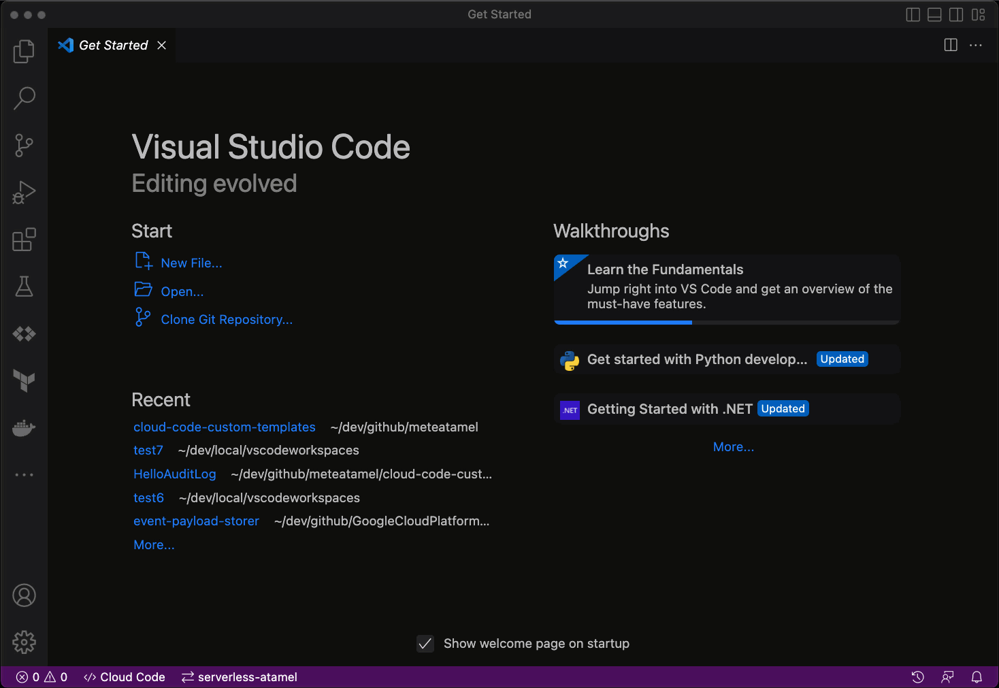

# Custom templates for Cloud Code

This repository contains some useful custom templates for Cloud Code for VS
Code. To use these templates, you can:

1. Click on `Cloud Code` in VS Code.
1. Select `New Application` -> `Custom Application` -> `Import Sample from Repo`
1. Point to this repo

More details in this
[doc](https://cloud.google.com/code/docs/vscode/create-app-from-custom-sample#creating_your_app_from_an_imported_sample)
page.

## Templates

* [.NET: Cloud Functions - HelloHttp](dotnet/cloud-functions/HelloHttp) - An
  HTTP triggered .NET Cloud Functions template.
* [.NET: Cloud Functions - HelloGcs](dotnet/cloud-functions/HelloGcs) - A
  Cloud Storage triggered .NET Cloud Functions template.
* [.NET: Cloud Functions - HelloPubSub](dotnet/cloud-functions/HelloPubSub) - A
  Pub/Sub triggered .NET Cloud Functions template.
* [.NET: Cloud Functions - HelloAuditLog](dotnet/cloud-functions/HelloAuditLog) - An
  AuditLog triggered .NET Cloud Functions template.

-------

This is not an official Google product.
